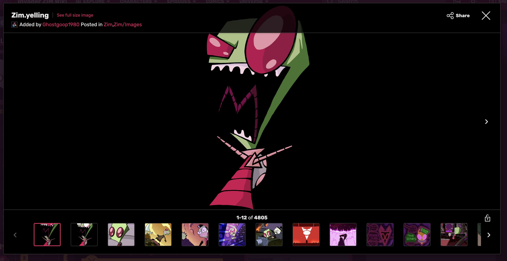

## Intro to JavaScript

- What is JS
- History of JS
- JS Versions
- How to run JS

### Code Search

**Prompt:**

Find an example of a web app or website that uses JavaScript to add interactivity to page.

**Instructions:**

Create 1 post that includes the following:

- Title & Description
  - The name of the real-world website/app
  - A brief summary of what the site / app is for
- Visual Reference
  - Include a screenshot or link to the example
- Explanation of Concept Usage
  - Describe how the site uses JavaScript to add interactivity
  - Reference specific features of the webpage or behaviors you observed
- Correct Terminology
  - Use terms introduced in class (e.g., script tag, click interaction, popup, ..etc)
  - Show that you understand how and why JavaScript is needed to make that feature or behavior work

**Title & Description**

Fandom Invader ZIM Wiki

A wiki site for information about the Invader Zim fandom. Invader Zim is a cartoon show.

**Visual Reference**

https://zim.fandom.com/wiki/Zim?file=Zim.yelling.svg



**Explanation of Concept Usage**

This site has a popup to navigate through the photo gallery. I believe that this is using JavaScript to control when the popup is showing or hidden. I believe this because the popup shows when you click the initial image then hides when you click the x button.

### Code Worksheet

<!-- markdown focused worksheet -->

Task 1

Format all "Task #" titles as a heading 3.

Task 2

Format a strikethrough for the EcmaScript (ES) version that wasn't released and write below the list what the EcmaScript versions are for.

- ES1
- ES2
- ES3
- ES4
- ES5
- ES6

**What is EcmaScript used for?**

Task 3

Below create a table serving as an analogy between the 3 browser languages and something of your choosing. The 3 browser languages being Hyper-Text Markup Language (HTML), Cascading Style Sheets (CSS), and JavaScript (JS). Have a header row containing 2 columns: Browser Language and your analogy title.

If I was using the analogy of a human body then HTML would be the skeleton, CSS the skin, and JS the brain. I might title this analogy Human Body. _**(You cannot use this example)**_

**Analogy Table:**

Task 4

Copy and paste the following prompt into an AI tool of your choice then copy and paste the generated JavaScript into the code block below.

```js
// waiting for code
```

Imagine that you are a brain needing to tell the human body how to perform the steps needed to test out this feature on the app. Write an ordered list with the instructions for testing the code above. _**(Do not use AI for this step)**_
